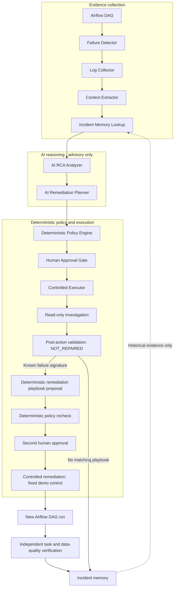
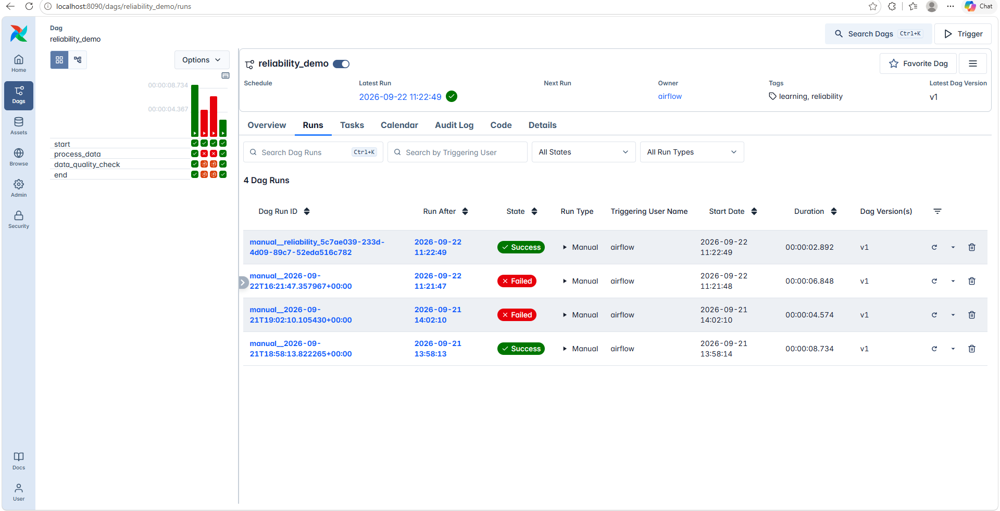
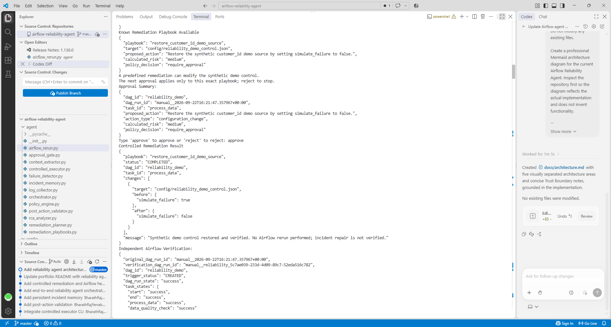

# Airflow Reliability Agent

A human-governed AI reliability agent for Apache Airflow. It detects pipeline failures, collects evidence, performs AI-assisted root cause analysis (RCA) and remediation planning, and applies deterministic safety policy. Controlled actions require human approval. For one known demo failure, a separately approved playbook repairs the synthetic control, the agent creates a new DAG run, and independent Airflow task and data-quality evidence verifies recovery.

## Why I Built This

Airflow failures often require engineers to inspect task states and logs, identify the root cause, determine a safe response, rerun workflows, and verify data quality. I built this project to explore how AI can assist that process while keeping execution deterministic, auditable, and human-governed.

## Architecture



The diagram shows the approved path; blocked, rejected, or invalid actions cannot advance to mutation. Historical matches are displayed for reference, not passed to the LLM or reused as authorization. The read-only executor checks incident, approval, and policy metadata in memory; it does not execute the model's proposed investigation instructions.

## End-to-End Demo

The manually triggered [`reliability_demo`](dags/reliability_demo.py) DAG has four tasks:

```text
start -> process_data -> data_quality_check -> end
```

`config/reliability_demo_control.json` controls the synthetic failure. With `simulate_failure=true`, `process_data` raises a controlled `ValueError` indicating that required source field `customer_id` is missing. Downstream tasks become `upstream_failed`. With the control disabled, processing doubles `[1, 2, 3]` into `[2, 4, 6]`; the data-quality task checks length, positive integer values, and exact expected contents through XCom.

The demonstrated recovery proceeds as follows:

1. Detect the `process_data` failure, collect its Airflow logs, and extract structured exception context.
2. Obtain AI RCA and a remediation proposal, then evaluate the proposal with deterministic policy.
3. Ask for approval of read-only investigation. Post-action validation correctly reports `NOT_REPAIRED` because no repair occurred.
4. Match the known DAG, task, `ValueError`, and exact message prefix to the allowlisted `restore_customer_id_demo_source` playbook.
5. Require a separate second approval. The playbook changes only the fixed demo control from `true` to `false`.
6. Create a **new Airflow DAG run** and read its run/task states. The DAG and all required tasks, including `data_quality_check`, must succeed before reporting `repair_verified=true` and `verification_status=VERIFIED_HEALTHY`.
7. Store the incident and verification evidence in local incident memory.

Successful demo verification example:

```text
Original failed run: manual__2026-09-22T16:21:47.357967+00:00
Verification run:    manual__reliability_5c7ae039-233d-4d09-89c7-52eda516c782

DAG:                  success
start:                success
process_data:         success
data_quality_check:   success
end:                  success
repair_verified:      true
verification_status:  VERIFIED_HEALTHY
```

The original failed run remains historical evidence. Recovery is established by the separate verification run.

## Demo Evidence

### Airflow Failure → Verified Recovery



The original `reliability_demo` run failed at `process_data`. The later `manual__reliability_...` run was created by the reliability agent for independent verification, and Airflow reports it as **Success**.

### Governed Remediation



The known failure matched the allowlisted `restore_customer_id_demo_source` playbook. Deterministic policy required human approval, and the controlled remediation changed only `simulate_failure` from `true` to `false`. The agent then created a new Airflow run and inspected its task states.

The agent does not mark a repair healthy because an LLM says the fix worked. `VERIFIED_HEALTHY` is produced only after the new Airflow run and all required tasks, including `data_quality_check`, succeed.

## Safety Design

- **LLM reasoning does not authorize execution.** Model output is validated data; no arbitrary shell, SQL, Docker commands, or production changes are executed from it.
- **Deterministic controls constrain execution.** Policy calculates risk independently of AI confidence and blocks dangerous proposals. Policy eligibility alone is not an execution grant.
- **Human approval is mandatory for mutations.** Read-only approval cannot authorize remediation; the known playbook requires a fresh, separate approval tied to the incident and fixed action.
- **Only allowlisted remediation can modify the demo control.** The single playbook's target and replacement contents are fixed by code. Model-supplied paths or instructions cannot select them.
- **Historical approvals cannot authorize new actions in the workflow.** Remediation and rerun authorization expire after 15 minutes. The standalone read-only executor has no expiry check.
- **Completion is not recovery.** A successful file change or API trigger is insufficient. A separate DAG run and successful required task/data-quality states are necessary; missing evidence, failures, and timeouts cannot produce verified health.

Approvals use local CLI reviewer labels and metadata, not cryptographic grants or production identity controls. Incident records support inspection and auditing but are not tamper-proof. Redaction reduces credential exposure; it is not a universal secret scanner.

## Main Components

All modules live under [`agent/`](agent/).

| Module | Responsibility |
| --- | --- |
| `failure_detector.py` | Authenticates through FAB JWT and inspects the latest 10 failed demo runs, distinguishing failed tasks from blocked downstream tasks. |
| `log_collector.py` | Fetches paginated logs for actual failed task attempts and redacts known authentication values. |
| `context_extractor.py` | Extracts compact structured exception evidence, preferring project stack frames, with text redaction. |
| `rca_analyzer.py` | Sends compact context to Groq and validates structured RCA output. |
| `remediation_planner.py` | Produces a validated advisory proposal with risk, validation steps, and rollback guidance. |
| `policy_engine.py` | Applies deterministic risk classification, dangerous-action checks, and playbook eligibility. |
| `approval_gate.py` | Creates approval records and accepts explicit human `approve` or `reject` input. |
| `controlled_executor.py` | Accepts only approved read-only metadata investigation; never interprets proposed instructions. |
| `post_action_validator.py` | Distinguishes execution completion from repair and separately assesses new-run health evidence. |
| `remediation_playbooks.py` | Matches the known failure and authorizes the fixed synthetic control change. |
| `airflow_rerun.py` | Creates one controlled verification run and polls REST evidence within a bounded deadline; does not retry ambiguous trigger requests. |
| `incident_memory.py` | Validates and redacts local JSONL history; ranks similar incidents using exact fields and message word overlap. |
| `orchestrator.py` | Coordinates the stages, separate approvals, optional playbook, rerun verification, reporting, and persistence. |

## Technology Stack

Python standard library for the host agent and tests; Apache Airflow **3.1.7** with `LocalExecutor`; PostgreSQL **16**; Docker / Docker Compose; Airflow REST API v2 with FAB JWT authentication; Groq's OpenAI-compatible chat completions API; Git.

Airflow runs inside Linux containers. The agent runs with host Python and needs no local Airflow installation or third-party Python packages.

## Running Locally

Run PowerShell from the repository root. Install host Python, start Docker Desktop with Linux containers (WSL 2 recommended), and use Docker Compose v2.14 or newer. Allocate at least 4 GB of Docker memory; 8 GB is preferable.

<details>
<summary>Fresh clone: create Docker configuration once</summary>

The Compose `.env` contains database, encryption, signing, and local UI settings. Preserve an existing file: changing its database password or encryption key can break access to stored data. `.env.example` contains only agent credential placeholders and is not a complete Compose configuration.

```powershell
if (Test-Path .env) { throw '.env already exists; keep your existing secrets.' }
$rng = [System.Security.Cryptography.RandomNumberGenerator]::Create()
function New-LocalSecret {
    $bytes = New-Object byte[] 32
    $rng.GetBytes($bytes)
    return [Convert]::ToBase64String($bytes).Replace('+', '-').Replace('/', '_')
}
$lines = @(
    'AIRFLOW_UID=50000'
    'AIRFLOW_ADMIN_USERNAME=airflow'
    'AIRFLOW_ADMIN_PASSWORD=airflow'
    ('POSTGRES_PASSWORD=' + (New-LocalSecret))
    ('AIRFLOW_FERNET_KEY=' + (New-LocalSecret))
    ('AIRFLOW_JWT_SECRET=' + (New-LocalSecret))
    ('AIRFLOW_API_SECRET_KEY=' + (New-LocalSecret))
)
[System.IO.File]::WriteAllLines((Join-Path (Get-Location) '.env'), $lines)
$rng.Dispose()
```

The example UI login is for local learning only. `.env` is ignored by Git. `AIRFLOW_UID=50000` works with Docker Desktop on Windows.

</details>

Initialize the database and admin account; wait for `airflow-init` to exit with code **0**:

```powershell
docker compose up airflow-init
```

Start services and check health:

```powershell
docker compose up -d
docker compose ps
```

Open <http://localhost:8090> and sign in with the credentials configured before initialization (`airflow` / `airflow` in the example). An exited init container is expected. Changing `.env` does not reset an existing UI user's password.

Set the agent's environment in the same PowerShell session:

```powershell
$env:AIRFLOW_API_USERNAME = '<your-local-airflow-username>'
$env:AIRFLOW_API_PASSWORD = '<your-local-airflow-password>'
$env:GROQ_API_KEY = '<your-groq-api-key>'
$env:GROQ_MODEL = 'openai/gpt-oss-120b'
```

`GROQ_MODEL` selects the model used for the demo; `openai/gpt-oss-120b` is the tested example shown above. The agent reads shell environment variables and does **not** automatically load `.env`. Its Airflow URL is fixed in code at `http://localhost:8090`. AI stages send compact, redacted failure context (and RCA for planning) to Groq, not full task logs.

<details>
<summary>Storage, shutdown, and troubleshooting</summary>

Compose mounts `dags/`, `logs/`, `plugins/`, and `config/` under `/opt/airflow/`. PostgreSQL metadata lives in the `postgres-data` volume, with no published database port. Agent history is stored separately in ignored `runtime/incidents.jsonl`.

Ordinary shutdown preserves metadata; restart with `up -d`:

```powershell
docker compose down
docker compose up -d
```

Validate configuration without displaying secrets and inspect startup problems:

```powershell
docker compose config --quiet
docker compose ps -a
docker compose logs --tail=100 airflow-init airflow-api-server airflow-scheduler airflow-dag-processor
docker compose exec airflow-scheduler airflow dags list-import-errors
```

If Docker cannot connect, start Docker Desktop and wait for its engine. Free port 8090 if occupied; changing the Compose host port also requires updating the agent's fixed URL. Check Docker Desktop directory access for bind-mount failures. Allow a minute for the DAG to appear and ensure it is unpaused.

Optional full reset: **this deletes Airflow run history, users, connections, and other PostgreSQL metadata**. Local files and agent history remain.

```powershell
docker compose down --volumes
docker compose up airflow-init
docker compose up -d
```

</details>

## Running the Reliability Agent

1. Set the synthetic failure control before triggering the demo. This resets the local demo to its failing state:

   ```powershell
   Copy-Item config/reliability_demo_control.example.json config/reliability_demo_control.json -Force
   Get-Content config/reliability_demo_control.json
   ```

   Expected contents: `{"simulate_failure": true}`. The file must exist for the remediation playbook, even though the DAG defaults to failure when it is missing.

2. In the Airflow UI, unpause `reliability_demo`, select **Trigger DAG**, and wait for the run to fail. This DAG has no automatic schedule.

3. Inspect failures, then run the complete workflow:

   ```powershell
   python -m agent.failure_detector
   python -m agent.orchestrator --task-id process_data
   ```

4. Review the RCA, proposal, and policy. For an eligible investigation, type exactly `approve` to accept the read-only stage, or `reject` to stop. The expected validation is `NOT_REPAIRED`.

5. If the known failure matches, review the fixed playbook and provide a **second, separate** `approve`. After applying the change, the agent itself creates the verification run. **Do not manually trigger the healthy verification run.**

Read the final report for `repair_verified` and `verification_status`; a successful CLI exit alone does not prove recovery. Verification has a default 120-second deadline. Model proposals can vary: blocked proposals or actions unsupported by the read-only executor will not reach remediation. Invalid input or interrupted approval never grants permission.

The detector considers the latest 10 failed runs, so earlier failures can appear even after recovery. The orchestrator offers at most one demo mutation per invocation and stops after that playbook attempt.

## Testing

The current suite contains **77 passing tests** across 10 test modules. Run the complete suite from the repository root:

```powershell
python -B -m unittest discover -s tests -v
```

Tests cover policy classification, approval transitions, executor and CLI refusal paths, post-action validation, incident history/redaction, orchestrator integration, fixed-target remediation, and new-run verification. Safety cases include historical or expired approvals, altered proposals, rejected second approval, unsupported commands, incomplete task evidence, failed data-quality checks, and API errors/timeouts.

The suite uses mocked API/model calls and temporary storage. It covers safety boundaries and happy paths without requiring Docker, Airflow, or Groq credentials; it is not a live-service integration test.

## Project Status

This is a **local portfolio and learning proof of concept**, not a production self-healing platform.

**Implemented:** failure inspection, structured evidence collection, AI RCA/planning, deterministic policy, interactive approval, read-only validation, one allowlisted remediation playbook, controlled rerun verification, and local JSONL incident history.

**Possible future work:** production authentication/authorization, a persistent production-grade incident store, multiple remediation playbooks, observability/metrics, deployment hardening, and broader DAG support. Current execution is specific to the synthetic demo and assumes a trusted local process with a single writer.

## Key Engineering Principle

> **AI can reason and propose. Deterministic controls authorize and execute. Airflow provides the independent evidence that the repair actually worked.**
