# Airflow Reliability Agent Architecture

A human-governed local proof of concept, coordinated by [`agent/orchestrator.py`](../agent/orchestrator.py). **AI reasons and proposes; the deterministic system authorizes, executes, and verifies under human approval.**

```mermaid
flowchart TD
    subgraph evidence["1. Apache Airflow / Evidence"]
        dag["reliability_demo DAG<br/>Airflow failure: process_data"]
        detect["Failure Detector"]
        logs["Log Collector"]
        context["Context Extractor"]
        lookup["Incident Memory Lookup<br/>Historical matches displayed only"]
        dag --> detect --> logs --> context --> lookup
    end

    subgraph ai["2. AI Reasoning - advisory only: REASON + PROPOSE"]
        rca["AI RCA Analyzer"]
        proposal["AI Remediation Planner<br/>LLM output cannot directly execute actions"]
        rca --> proposal
    end
    lookup -->|Current failure context| rca

    subgraph governance["3. Deterministic Safety / Governance - AUTHORIZE"]
        policy["Policy Engine<br/>Deterministic risk and action checks"]
        approval["Human Approval Gate"]
        executor["Controlled Executor<br/>Read-only investigation: metadata checks"]
        validator["Post-Action Validator<br/>NOT_REPAIRED: no mutation performed"]
        policy -->|Eligible investigation| approval
        approval -->|Explicit approval| executor
        executor -->|Completed| validator
    end
    proposal -->|Validated proposal data only| policy

    subgraph remediation["4. Controlled Remediation Path - AUTHORIZE + EXECUTE"]
        match{"Known failure signature match?<br/>Demo DAG + process_data + ValueError<br/>Exact missing customer_id message prefix"}
        playbook["Allowlisted deterministic playbook<br/>restore_customer_id_demo_source<br/>Fixed remediation proposal"]
        recheck["Policy recheck"]
        second["Second fresh human approval<br/>Separate incident-bound approval ID"]
        mutate["Controlled remediation<br/>Revalidate authorization and fixed target<br/>simulate_failure: true to false"]
        match -->|Yes| playbook --> recheck
        recheck -->|Eligible| second
        second -->|Approved and current| mutate
    end
    validator -->|NOT_REPAIRED| match

    subgraph verification["5. Independent Verification - VERIFY"]
        trigger["Recheck remediation authorization<br/>Trigger NEW Airflow DAG run"]
        poll["Poll DAG state; read task states<br/>Airflow REST API, bounded deadline"]
        required{"Independent evidence complete?<br/>New DAG run = success<br/>start = success<br/>process_data = success<br/>data_quality_check = success<br/>end = success<br/>All returned task states = success"}
        healthy["VERIFIED_HEALTHY<br/>repair_verified = true"]
        unverified["VERIFICATION_FAILED / TIMEOUT / INCONCLUSIVE<br/>repair_verified = false"]
        memory[("Incident Memory<br/>Store final outcome and evidence<br/>runtime/incidents.jsonl")]
        trigger --> poll --> required
        required -->|Yes| healthy --> memory
        required -->|Failed or incomplete evidence| unverified --> memory
        trigger -->|API error or deadline exceeded| unverified
        poll -->|API error or deadline exceeded| unverified
    end
    mutate -->|Completed; repair still unverified| trigger
    match -->|No: retain NOT_REPAIRED| memory
    memory -.->|Historical reference only; never authorization| lookup

    classDef evidenceNode fill:#eff6ff,stroke:#2563eb,color:#172554
    classDef aiNode fill:#faf5ff,stroke:#9333ea,color:#3b0764
    classDef controlNode fill:#fffbeb,stroke:#d97706,color:#451a03
    classDef verifyNode fill:#f0fdf4,stroke:#16a34a,color:#14532d
    classDef failureNode fill:#fff1f2,stroke:#e11d48,color:#881337
    class dag,detect,logs,context,lookup,memory evidenceNode
    class rca,proposal aiNode
    class policy,approval,executor,validator,match,playbook,recheck,second,mutate controlNode
    class trigger,poll,required,healthy verifyNode
    class unverified failureNode
```

## Trust Boundary

- **LLM output is advisory.** Historical matches are displayed for reference; the AI receives current failure context, with RCA added for planning.
- **Model output cannot choose arbitrary execution paths, files, or commands.** The single remediation playbook fixes both the target (`config/reliability_demo_control.json`) and its replacement content in code.
- **Mutating remediation requires separate human approval.** Read-only or historical approvals cannot authorize it; remediation and rerun authorization expire after 15 minutes.
- **Successful execution alone does not equal recovery.** The controlled file change and successful API trigger leave repair unverified until independent evidence is collected.
- **Airflow task and data-quality evidence determines `VERIFIED_HEALTHY`.** The new run and all required tasks must succeed; AI claims, missing evidence, failures, and timeouts cannot establish recovery.

The diagram emphasizes the approved recovery path. Blocked, rejected, invalid, or expired authorization prevents the corresponding action. Read-only investigation checks metadata in memory; it does not execute proposed instructions. This is a local demo with local approval metadata, not a production-ready platform.
